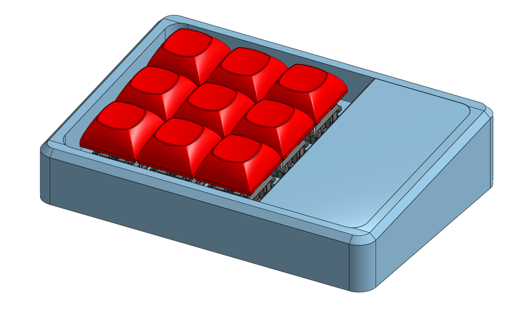
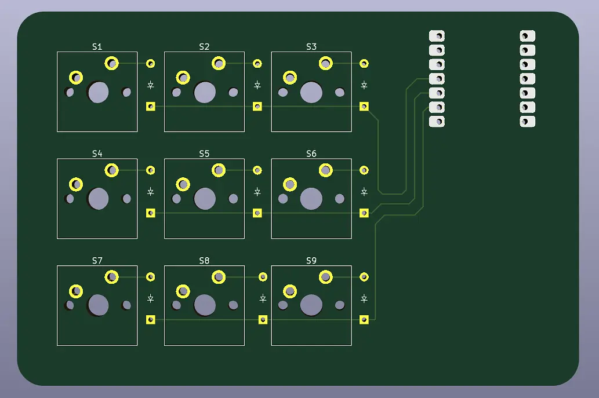
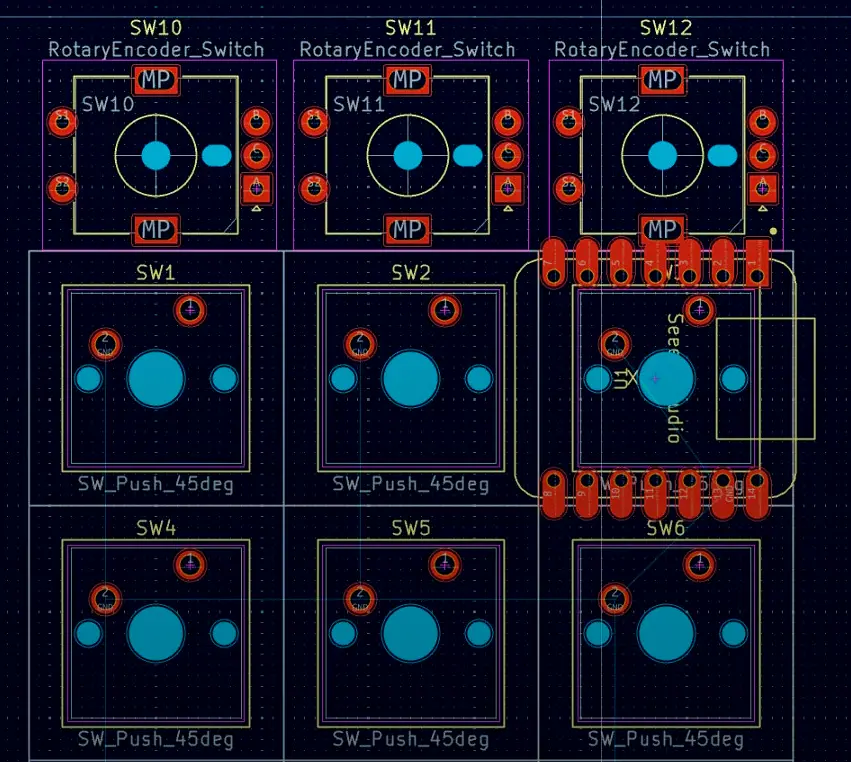

# My Macropad

This is my small open sourced 6 key macropad project, this is mainly built arounf the **Seeed Studio XIAO RP2040**, but the case also supports the **Micro Pico** but using the micro will require a minor wiring change to the PCB and minor changes to the _Firmware_ code.

## Authors

- [@Mitansh05](https://github.com/Mitansh05)

## Documentation

[Documentation](https://stardance.hackclub.com/projects/44402)

## PC Images

### Schematic

- This is another viable PCB desing that can also be used, this design was made for compact or smaller cases.

## CAD

[OnShape](https://cad.onshape.com/documents/91fbd2ecc812749314d70d96/w/e7b00437c586504b0e660677/e/854394856a88eebcf7cbc972?renderMode=0&uiState=6a766f25c520667d42b590b3)

## Parts List

| Item Name                 | Quantity | Cost (USD) | Link                                                                                                                                                                                                                                                                                     |
| ------------------------- | -------- | ---------- | ---------------------------------------------------------------------------------------------------------------------------------------------------------------------------------------------------------------------------------------------------------------------------------------- |
| XIAO RP2040               | 1        | $5.00      | [Link](http://seeedstudio.com/XIAO-RP2040-v1-0-p-5026.html)                                                                                                                                                                                                                              |
| Case                      | 1        | 3D Printed | Check CAD                                                                                                                                                                                                                                                                                |
| 1N4148 Diodes             | x20      | ~$0.90     | [Link](https://www.digikey.com/en/products/detail/onsemi/1N4148/458603)                                                                                                                                                                                                                  |
| MX-Style switches         | x6       | $2.99      | [Link](https://mechanicalkeyboards.com/products/cherry-mx-blue-60g-clicky?variant=48007305068844&country=US&currency=USD&utm_medium=product_sync&utm_source=google&utm_content=sag_organic&utm_campaign=sag_organic&srsltid=AfmBOopiZ_joPRzTFp1mFW79VMCUlGigiHmFmm0k4ss6ifBDeinPYpJ8qkU) |
| DSA keycaps               | x6       | $5.95      | [Link](https://www.adafruit.com/product/4997?srsltid=AfmBOopVhiPU6UWQkoyK0_OuW6ztzQafc0ylhup_JsTFFhoGshZSN97-tkQ)                                                                                                                                                                        |
| M3x16mm screws            | x6       | $2.98      | [Link](https://www.lowes.com/pd/Hillman-3mm-0-5-x-16mm-Phillips-Drive-Machine-Screws-12-Count/999994900?store_code=2319)                                                                                                                                                                 |
| M3x5mx4mm heatset inserts | x6       | $0.99      | [Link](https://www.aliexpress.us/item/2255800046543591.html)                                                                                                                                                                                                                             |

## 🚀 Software Installation Setup

Follow these quick steps to flash and launch the firmware:

### Step 1: Install CircuitPython

1. Hold down the physical **`BOOT`** / **`BOOTSEL`** button on your Seeed XIAO board.
2. Select **everything inside** your local `Firmware` folder (`kmk`, `boot.py`, `code.py`, `keymap.py`).
3. Drag and drop them straight into the **`CIRCUITPY`** drive root directory.
4. Safely eject the drive from your operating system, unplug the physical USB cable for 3 seconds, and plug it back in to initialize the fresh macros!

---

## ⌨️ Active Layout Blueprint

Your 9 keys operate in this exact grid layout, optimized natively for Windows/Linux platforms:

| Left Column                     | Center Column                    | Right Column                   |
| :------------------------------ | :------------------------------- | :----------------------------- |
| **📑 Copy** `Pin D0`         | **📋 Paste** `Pin D1`         | **📊 Calculator** `Pin D2`  |
| **🎵 Play / Pause** `Pin D3` | **⏮️ Prev Track** `Pin D4`    | **🔇 Panic Mute** `Pin D5`  |
| **🛠️ Task Manager** `Pin D6` | **✂️ Snipping Tool** `Pin D7` | **🔒 Lock Screen** `Pin D8` |

## Resources Used

[HackClub HackPad](https://hackpad.hackclub.com/guide)

[KiCad](https://www.kicad.org/)
