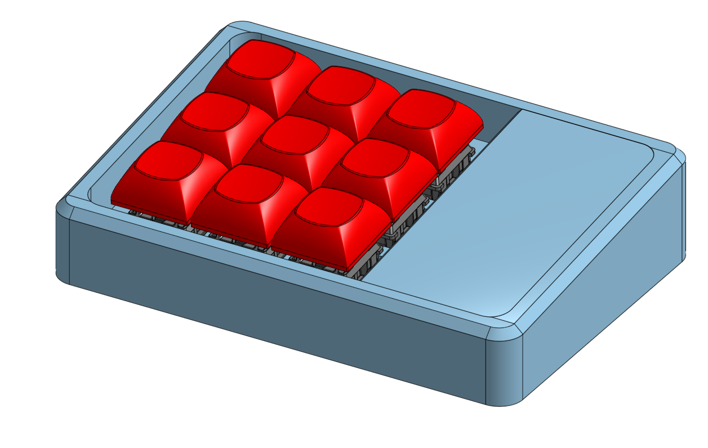
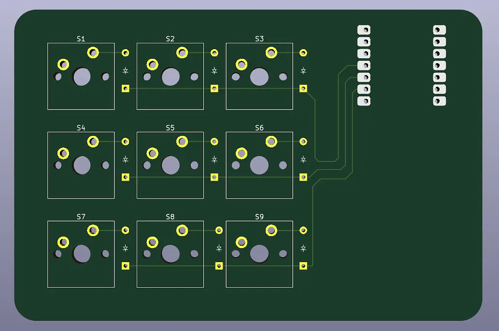
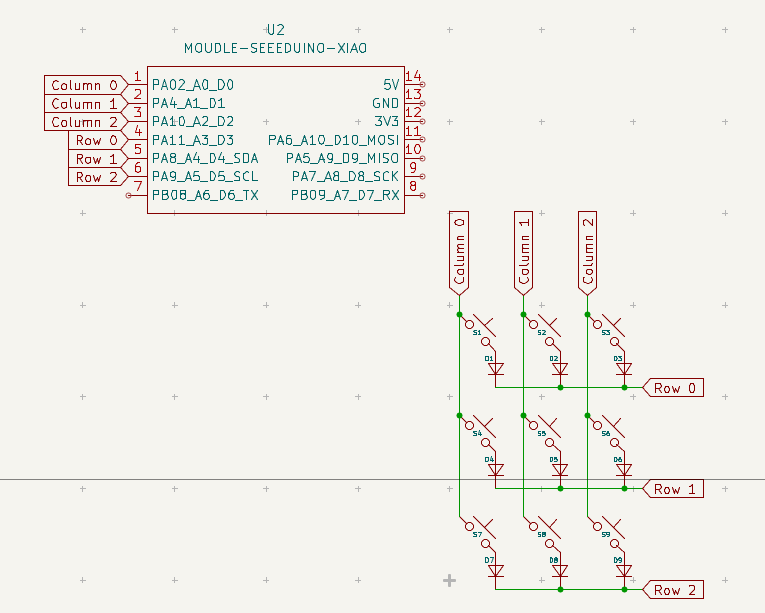
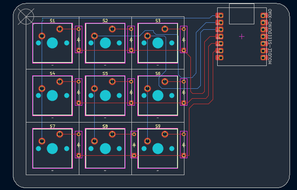
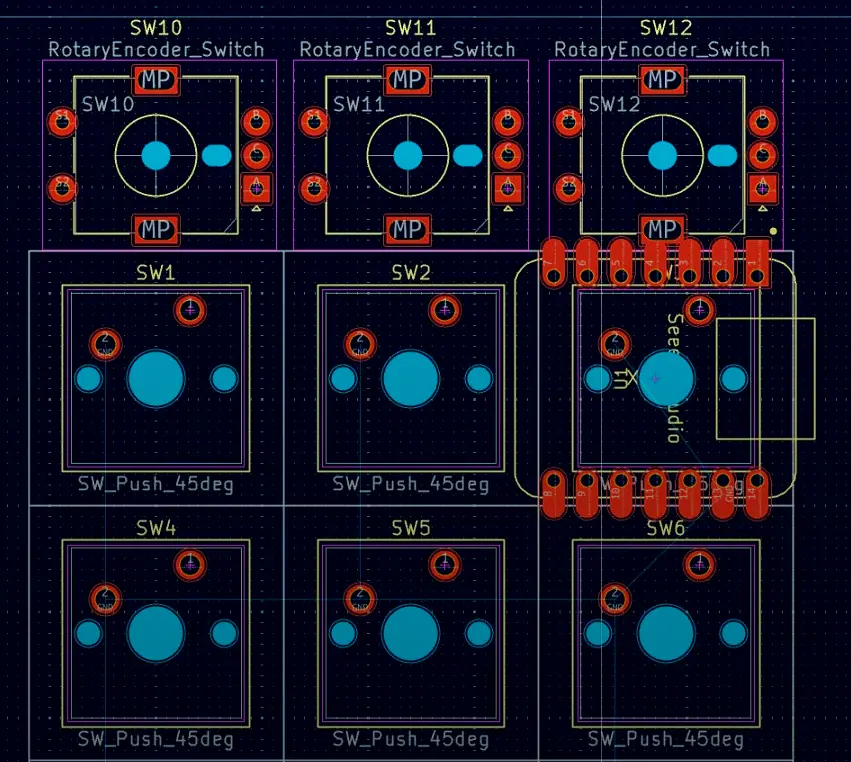

# My Macropad

This is my open source 9-key macropad, this project is mainly built around the **Seeed Studio XIAO RP2040**, but I have also provided some files that will help you if you want to use the **Micro Pico**.

## Author

- [@Mitansh05](https://github.com/Mitansh05)

## PCB

### Try it yourself

### Schematic / PCB imgs

#### Pico:

## Getting Started - Firmware / setup

- Step 1: Install **CircuitPython**.
- Step 2: Hold down the physical **`BOOT`** / **`BOOTSEL`** button on your Seeed XIAO board.
- Step 3: Drag and drop all of the files inside `Firmware` folder (`kmk`, `boot.py`, `code.py`, `keymap.py`) into the **CIRCUITPY** inside the XIAO.
- Step 4: Safely eject the drive from your decvice, physically unplug the USB cable from the XIAO for ~3sec and then plug it back in to make sure the macros are initialized.

### Active Layout Blueprint

This is the 9 key layout that is pre-loaded on the macropad.

| Left Column                     | Center Column                    | Right Column                   |
| :------------------------------ | :------------------------------- | :----------------------------- |
| **📑 Copy** `Pin D0`         | **📋 Paste** `Pin D1`         | **📊 Calculator** `Pin D2`  |
| **🎵 Play / Pause** `Pin D3` | **⏮️ Prev Track** `Pin D4`    | **🔇 Panic Mute** `Pin D5`  |
| **🛠️ Task Manager** `Pin D6` | **✂️ Snipping Tool** `Pin D7` | **🔒 Lock Screen** `Pin D8` |

## Resources Used

[HackClub HackPad](https://hackpad.hackclub.com/guide)

[KiCad](https://www.kicad.org/)

### Additional info

- Docunmentation can be found on [HackClub](https://stardance.hackclub.com/projects/44402)
